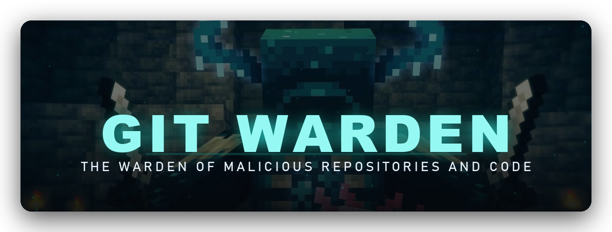
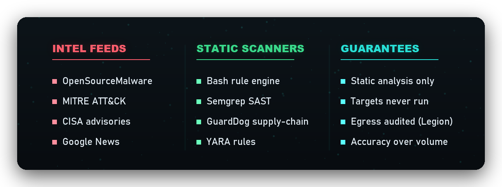

<p align="center">
  
</p>

<p align="center">
  
  <a href="LICENSE"></a>
  <a href="https://www.python.org"></a>
</p>

<p align="center">
  
</p>

> **The Warden cannot see. It listens for what code *does*.**
> Git Warden never executes a target; it reads the code statically and senses the
> behaviors that betray malice, the way the Warden senses vibration in the dark.

A defensive threat-intelligence engine that discovers, analyzes, and catalogs
**malicious GitHub repositories**. Threat-intel feeds
([MITRE ATT&CK](https://attack.mitre.org), [Google News](https://news.google.com),
[CISA](https://www.cisa.gov), [OpenSourceMalware](https://opensourcemalware.com))
are *provenance breadcrumbs*; they help find and attribute the repos. The product
is the registry of malicious repos.

See [docs/](docs/) for the design and [docs/IMPLEMENTATION.md](docs/IMPLEMENTATION.md)
for what's built vs. planned. Guiding principle: **accuracy over volume.**

<p align="center"></p>

## How it works

```
INGEST (breadcrumbs)                 HUNT (find malicious GitHub repos)
  MITRE ATT&CK ─┐                      ┌─ IOC search: mirror OSM IOCs into
  Google News  ─┼─ corroborate ─►      │   GitHub code search ----|
  CISA         ─┘   threat actors      ├─ red-team lineage: forks/│
  OpenSourceMalware ─► malicious       │   renames of pinned tools┤
     packages/repos + IOCs ────────────┘                          ▼
                                        Tier-1 screen (name+README, no clone)
                                                          │
                                        Tier-2 (clone + bash scanner + OSS
                                          scanners + code-hash dedup)
                                                          ▼
                                        Wall of Shame ─► Discord gold
```

<p align="center"></p>

## Wall of Shame

<p align="center">
  
</p>

Repositories Git Warden confirmed malicious by static analysis, refreshed on
every run. A repo confirms only on intrinsically malicious evidence
(`eval(atob(...))` injected into a build config, a reverse shell, a credential
steal-and-send); threat-intel leads (a malicious owner, a shared signature) only
*seed* which repos get scanned, never confirm one alone.

<!-- git-warden:registry:start -->
_57 repositories confirmed malicious by static analysis, regenerated each run. Every row's evidence (file, line, rule) is in the run artifacts CSV. Dispute: open an issue and we will re-review._

| Repository | Detection | Score | Attribution | First seen | Why |
|------------|-----------|-------|-------------|------------|-----|
| [`anon-exploiter/sliver-cheatsheet`](https://github.com/anon-exploiter/sliver-cheatsheet) | redteam_lineage | 55 | unattributed | hunt-20260618T201449Z | name_match of pinned red-team tool Sliver \| Tier-2 confirmed (bash score 46) |
| [`yuxiangggg/shiver`](https://github.com/yuxiangggg/shiver) | redteam_lineage | 26 | unattributed | hunt-20260618T201449Z | fork of pinned red-team tool Sliver \| Tier-2 confirmed (bash score 21) |
| [`investlab/malware-sliver`](https://github.com/investlab/malware-sliver) | redteam_lineage | 25 | unattributed | hunt-20260618T201449Z | fork of pinned red-team tool Sliver \| Tier-2 confirmed (bash score 21) |
| [`joapath/pamperoc2`](https://github.com/joapath/pamperoc2) | redteam_lineage | 25 | unattributed | hunt-20260618T201449Z | fork of pinned red-team tool Sliver \| Tier-2 confirmed (bash score 21) |
| [`kaluabd/watchsliv`](https://github.com/kaluabd/watchsliv) | redteam_lineage | 25 | unattributed | hunt-20260618T201449Z | fork of pinned red-team tool Sliver \| Tier-2 confirmed (bash score 21) |
| [`lishizhendep/hacccck`](https://github.com/lishizhendep/hacccck) | redteam_lineage | 25 | unattributed | hunt-20260618T201449Z | fork of pinned red-team tool Sliver \| Tier-2 confirmed (bash score 21) |
| [`icecoldjay/infin8solution`](https://github.com/icecoldjay/infin8solution) | malicious_owner | 18 | unattributed | hunt-20260621T204101Z | repository under owner icecoldjay of a known-malicious repo \| Tier-2 confirmed (bash score 18) |
| [`web3underbelly/malware-monkey`](https://github.com/web3underbelly/malware-monkey) | redteam_lineage | 16 | unattributed | hunt-20260618T201449Z | fork of pinned red-team tool Infection Monkey \| Tier-2 confirmed (bash score 10) |
| [`apersonintech/infection-monkey`](https://github.com/apersonintech/infection-monkey) | redteam_lineage | 15 | unattributed | hunt-20260618T201449Z | fork of pinned red-team tool Infection Monkey \| Tier-2 confirmed (bash score 10) |
| [`blupblob/infectionmonkey`](https://github.com/blupblob/infectionmonkey) | redteam_lineage | 15 | unattributed | hunt-20260618T201449Z | fork of pinned red-team tool Infection Monkey \| Tier-2 confirmed (bash score 10) |
| [`alexsander532/projeto_dashboard_versao1`](https://github.com/alexsander532/projeto_dashboard_versao1) | malicious_owner | 14 | unattributed | hunt-20260621T204101Z | repository under owner Alexsander532 of a known-malicious repo \| Tier-2 confirmed (bash score 14) |
| [`gomboc-ai-dev/monkey-gomboc`](https://github.com/gomboc-ai-dev/monkey-gomboc) | redteam_lineage | 14 | unattributed | hunt-20260618T201449Z | fork of pinned red-team tool Infection Monkey \| Tier-2 confirmed (bash score 10) |
| [`lloydchang/guardicore-monkey`](https://github.com/lloydchang/guardicore-monkey) | redteam_lineage | 14 | unattributed | hunt-20260618T201449Z | fork of pinned red-team tool Infection Monkey \| Tier-2 confirmed (bash score 10) |
| [`dante-eraa/feodus-exploit-pentesting`](https://github.com/dante-eraa/feodus-exploit-pentesting) | redteam_lineage | 13 | unattributed | hunt-20260618T201449Z | fork of pinned red-team tool Metasploit Framework \| Tier-2 confirmed (bash score 9) |
| [`cisoeynu/infectionmonkey`](https://github.com/cisoeynu/infectionmonkey) | redteam_lineage | 12 | unattributed | hunt-20260618T201449Z | fork of pinned red-team tool Infection Monkey \| Tier-2 confirmed (bash score 7) |
| [`u16052642/infection-monkey`](https://github.com/u16052642/infection-monkey) | redteam_lineage | 12 | unattributed | hunt-20260618T201449Z | fork of pinned red-team tool Infection Monkey \| Tier-2 confirmed (bash score 7) |
| [`usmanaliashraf/portfolio`](https://github.com/usmanaliashraf/portfolio) | signature_match | 12 | unattributed | hunt-20260620T172657Z | Shares a confirmed-malware code signature ['Jzt2YXIgXyRfMWU0Mj0oZnVuY3Rpb24obCxlKXt2YXIgaD1sLm'] \| Tier-2 confirmed (bash score 12) |
| [`webdienste/infectionmonkey`](https://github.com/webdienste/infectionmonkey) | redteam_lineage | 12 | unattributed | hunt-20260618T201449Z | fork of pinned red-team tool Infection Monkey \| Tier-2 confirmed (bash score 7) |
| [`covenantsql/covenantforum`](https://github.com/covenantsql/covenantforum) | redteam_lineage | 11 | unattributed | hunt-20260618T201449Z | name_match of pinned red-team tool Covenant \| Tier-2 confirmed (bash score 7) |
| [`iac-playground/guardicore-monkey`](https://github.com/iac-playground/guardicore-monkey) | redteam_lineage | 11 | unattributed | hunt-20260618T201449Z | fork of pinned red-team tool Infection Monkey \| Tier-2 confirmed (bash score 7) |
| [`icecoldjay/bri`](https://github.com/icecoldjay/bri) | signature_match | 11 | unattributed | hunt-20260620T172657Z | Shares a confirmed-malware code signature ['eval atob filename:tailwind.config.js'] \| Tier-2 confirmed (bash score 11) |
| [`macxsz/monkey-developer`](https://github.com/macxsz/monkey-developer) | redteam_lineage | 11 | unattributed | hunt-20260618T201449Z | fork of pinned red-team tool Infection Monkey \| Tier-2 confirmed (bash score 7) |
| [`matthewsweeney/guardicore-monkey`](https://github.com/matthewsweeney/guardicore-monkey) | redteam_lineage | 11 | unattributed | hunt-20260618T201449Z | fork of pinned red-team tool Infection Monkey \| Tier-2 confirmed (bash score 7) |
| [`neo-glitch88/infection-monkey-red-team`](https://github.com/neo-glitch88/infection-monkey-red-team) | redteam_lineage | 11 | unattributed | hunt-20260618T201449Z | fork of pinned red-team tool Infection Monkey \| Tier-2 confirmed (bash score 7) |
| [`qiaojo/monkey-01`](https://github.com/qiaojo/monkey-01) | redteam_lineage | 11 | unattributed | hunt-20260618T201449Z | fork of pinned red-team tool Infection Monkey \| Tier-2 confirmed (bash score 7) |
| [`saas-s/monkey-red-team`](https://github.com/saas-s/monkey-red-team) | redteam_lineage | 11 | unattributed | hunt-20260618T201449Z | fork of pinned red-team tool Infection Monkey \| Tier-2 confirmed (bash score 7) |
| [`thec0nci3rge/infection-monkey-v2.3.0`](https://github.com/thec0nci3rge/infection-monkey-v2.3.0) | redteam_lineage | 11 | unattributed | hunt-20260618T201449Z | fork of pinned red-team tool Infection Monkey \| Tier-2 confirmed (bash score 7) |
| [`alexsander532/atlas_landingpage`](https://github.com/alexsander532/atlas_landingpage) | signature_match | 9 | unattributed | hunt-20260620T172657Z | Shares a confirmed-malware code signature ['Jzt2YXIgXyRfMWU0Mj0oZnVuY3Rpb24obCxlKXt2YXIgaD1sLm'] \| Tier-2 confirmed (bash score 8) |
| [`alexsander532/mvp_wain_group130`](https://github.com/alexsander532/mvp_wain_group130) | signature_match | 9 | unattributed | hunt-20260620T172657Z | Shares a confirmed-malware code signature ['Jzt2YXIgXyRfMWU0Mj0oZnVuY3Rpb24obCxlKXt2YXIgaD1sLm'] \| Tier-2 confirmed (bash score 8) |
| [`alexsander532/synapseai_landingpage`](https://github.com/alexsander532/synapseai_landingpage) | signature_match | 9 | unattributed | hunt-20260620T172657Z | Shares a confirmed-malware code signature ['Jzt2YXIgXyRfMWU0Mj0oZnVuY3Rpb24obCxlKXt2YXIgaD1sLm'] \| Tier-2 confirmed (bash score 8) |
| [`alexsander532/portfolio-pessoal`](https://github.com/alexsander532/portfolio-pessoal) | malicious_owner | 8 | unattributed | hunt-20260621T204101Z | repository under owner Alexsander532 of a known-malicious repo \| Tier-2 confirmed (bash score 8) |
| [`alexsander532/synapse_ai`](https://github.com/alexsander532/synapse_ai) | malicious_owner | 8 | unattributed | hunt-20260621T204101Z | repository under owner Alexsander532 of a known-malicious repo \| Tier-2 confirmed (bash score 8) |
| [`alexsander532/synapseai`](https://github.com/alexsander532/synapseai) | signature_match | 8 | unattributed | hunt-20260620T172657Z | Shares a confirmed-malware code signature ['Jzt2YXIgXyRfMWU0Mj0oZnVuY3Rpb24obCxlKXt2YXIgaD1sLm'] \| Tier-2 confirmed (bash score 8) |
| [`bambao1-lang/bambao1-lang.github.io`](https://github.com/bambao1-lang/bambao1-lang.github.io) | signature_match | 8 | unattributed | hunt-20260620T172657Z | Shares a confirmed-malware code signature ['eval atob filename:postcss.config.js'] \| Tier-2 confirmed (bash score 8) |
| [`haroontaufiq/cosmic-questionnaire`](https://github.com/haroontaufiq/cosmic-questionnaire) | signature_match | 8 | unattributed | hunt-20260620T172657Z | Shares a confirmed-malware code signature ['Jzt2YXIgXyRfMWU0Mj0oZnVuY3Rpb24obCxlKXt2YXIgaD1sLm'] \| Tier-2 confirmed (bash score 8) |
| [`usmanaliashraf/rag-bot-uet-science-society`](https://github.com/usmanaliashraf/rag-bot-uet-science-society) | malicious_owner | 8 | unattributed | hunt-20260621T204101Z | repository under owner UsmanAliAshraf of a known-malicious repo \| Tier-2 confirmed (bash score 8) |
| [`alexsander532/get_estoque_mlbling_microservice`](https://github.com/alexsander532/get_estoque_mlbling_microservice) | malicious_owner | 5 | unattributed | hunt-20260621T204101Z | repository under owner Alexsander532 of a known-malicious repo \| Tier-2 confirmed (bash score 4) |
| [`icecoldjay/salamanda-frontend`](https://github.com/icecoldjay/salamanda-frontend) | malicious_owner | 4 | unattributed | hunt-20260621T204101Z | repository under owner icecoldjay of a known-malicious repo \| Tier-2 confirmed (bash score 4) |
| [`shamratdev/ai-banking`](https://github.com/shamratdev/ai-banking) | signature_match | 4 | unattributed | hunt-20260620T172657Z | Shares a confirmed-malware code signature ['eval atob filename:tailwind.config.js'] \| Tier-2 confirmed (bash score 4) |
| [`icecoldjay/aave-flashloan-frontend`](https://github.com/icecoldjay/aave-flashloan-frontend) | malicious_owner | 1 | unattributed | hunt-20260621T204101Z | repository under owner icecoldjay of a known-malicious repo \| Tier-2 confirmed (bash score 0) |
| [`icecoldjay/fabric-loan-network`](https://github.com/icecoldjay/fabric-loan-network) | malicious_owner | 1 | unattributed | hunt-20260621T204101Z | repository under owner icecoldjay of a known-malicious repo \| Tier-2 confirmed (bash score 1) |
| [`icecoldjay/learn2earn`](https://github.com/icecoldjay/learn2earn) | malicious_owner | 1 | unattributed | hunt-20260621T204101Z | repository under owner icecoldjay of a known-malicious repo \| Tier-2 confirmed (bash score 1) |
| [`icecoldjay/mercury-frontend`](https://github.com/icecoldjay/mercury-frontend) | malicious_owner | 1 | unattributed | hunt-20260621T204101Z | repository under owner icecoldjay of a known-malicious repo \| Tier-2 confirmed (bash score 0) |
| [`icecoldjay/trading-bot-frontend`](https://github.com/icecoldjay/trading-bot-frontend) | malicious_owner | 1 | unattributed | hunt-20260621T204101Z | repository under owner icecoldjay of a known-malicious repo \| Tier-2 confirmed (bash score 0) |
| [`icecoldjay/trading-bot-server`](https://github.com/icecoldjay/trading-bot-server) | malicious_owner | 1 | unattributed | hunt-20260621T204101Z | repository under owner icecoldjay of a known-malicious repo \| Tier-2 confirmed (bash score 0) |
| [`usmanaliashraf/wheel-of-fortune`](https://github.com/usmanaliashraf/wheel-of-fortune) | malicious_owner | 1 | unattributed | hunt-20260621T204101Z | repository under owner UsmanAliAshraf of a known-malicious repo \| Tier-2 confirmed (bash score 0) |
| [`alexsander532/nea-mutiro-site`](https://github.com/alexsander532/nea-mutiro-site) | malicious_owner | 0 | unattributed | hunt-20260621T204101Z | repository under owner Alexsander532 of a known-malicious repo \| Tier-2 confirmed (bash score 0) |
| [`alexsander532/projeto_gerenciamentovideos_nodejs`](https://github.com/alexsander532/projeto_gerenciamentovideos_nodejs) | malicious_owner | 0 | unattributed | hunt-20260621T204101Z | repository under owner Alexsander532 of a known-malicious repo \| Tier-2 confirmed (bash score 0) |
| [`haroontaufiq/ai-sdk-fundamentals`](https://github.com/haroontaufiq/ai-sdk-fundamentals) | malicious_owner | 0 | unattributed | hunt-20260621T204101Z | repository under owner HaroonTaufiq of a known-malicious repo \| Tier-2 confirmed (bash score 0) |
| [`haroontaufiq/au_blog_website`](https://github.com/haroontaufiq/au_blog_website) | malicious_owner | 0 | unattributed | hunt-20260621T204101Z | repository under owner HaroonTaufiq of a known-malicious repo \| Tier-2 confirmed (bash score 0) |
| [`haroontaufiq/book-explorer-app`](https://github.com/haroontaufiq/book-explorer-app) | malicious_owner | 0 | unattributed | hunt-20260621T204101Z | repository under owner HaroonTaufiq of a known-malicious repo \| Tier-2 confirmed (bash score 0) |
| [`haroontaufiq/click-fit`](https://github.com/haroontaufiq/click-fit) | malicious_owner | 0 | unattributed | hunt-20260621T204101Z | repository under owner HaroonTaufiq of a known-malicious repo \| Tier-2 confirmed (bash score 0) |
| [`haroontaufiq/mslearn-profile`](https://github.com/haroontaufiq/mslearn-profile) | malicious_owner | 0 | unattributed | hunt-20260621T204101Z | repository under owner HaroonTaufiq of a known-malicious repo \| Tier-2 confirmed (bash score 0) |
| [`haroontaufiq/netflix-clone`](https://github.com/haroontaufiq/netflix-clone) | malicious_owner | 0 | unattributed | hunt-20260621T204101Z | repository under owner HaroonTaufiq of a known-malicious repo \| Tier-2 confirmed (bash score 0) |
| [`haroontaufiq/zyra-platform-feature-app`](https://github.com/haroontaufiq/zyra-platform-feature-app) | malicious_owner | 0 | unattributed | hunt-20260621T204101Z | repository under owner HaroonTaufiq of a known-malicious repo \| Tier-2 confirmed (bash score 0) |
| [`icecoldjay/aave-flashloan`](https://github.com/icecoldjay/aave-flashloan) | malicious_owner | 0 | unattributed | hunt-20260621T204101Z | repository under owner icecoldjay of a known-malicious repo \| Tier-2 confirmed (bash score 0) |
| [`usmanaliashraf/primesol`](https://github.com/usmanaliashraf/primesol) | malicious_owner | 0 | unattributed | hunt-20260621T204101Z | repository under owner UsmanAliAshraf of a known-malicious repo \| Tier-2 confirmed (bash score 0) |
<!-- git-warden:registry:end -->

> [!NOTE]
> Every row's evidence (file, line, and the rule that fired) is in the per-run
> artifacts, so each listing is falsifiable. **Dispute a listing:** open an issue
> with the repository name and we will re-review and remove false positives.

<p align="center"></p>

## Quick start

```bash
pip install -e ".[dev]"          # or run without install: python gw.py <cmd>
cp .env.example .env             # add GW_GITHUB_TOKEN, GW_OSM_API_KEY, ...
```

Credentials load from `.env` automatically (real env vars win). Tokens:

| Var | What | Notes |
|-----|------|-------|
| `GW_GITHUB_TOKEN` | GitHub PAT, **read-only public** | required for code search + 5k/hr |
| `GW_OSM_API_KEY` | OpenSourceMalware token (`osm_…`) | Bearer auth |
| `GW_DISCORD_WEBHOOK` | gold/alert channel | confirmed findings only |

(No NVD key needed; free OSINT feeds + OSM cover the intel sources for now.)

## Commands

```bash
python gw.py ingest                         # feeds -> actors + OSM artifacts
python gw.py iocs                            # IOC pivot set mined from OSM
python gw.py discover                        # IOC code search -> new repos
python gw.py lineage --tool Sliver --screen 12   # red-team clones + Tier-1
python gw.py screen-artifacts                # Tier-1 over OSM repo scan-list
python gw.py hunt --scan --gold              # full pipeline -> Wall of Shame -> Discord
python gw.py review --approve owner/repo     # analyst-validate a confirmed repo
python gw.py probe --feed github --term lazarus  # probe any feed live
```

## Deployment

GitHub Actions ([.github/workflows/](.github/workflows/)): `ci.yml` runs
lint+tests; `run.yml` runs ingest→hunt weekly (manual first, per doc 05). Every
workflow hardens the runner first (Legion egress audit).

Add these **repo Actions secrets**; the workflow maps them onto the `GW_*` env
vars the code reads (local `.env` uses the `GW_*` names directly):

| Repo secret | Maps to env var.  |
|-------------|-----------------  |
| `GH_TOKEN`  | `GW_GITHUB_TOKEN` |
| `OSM_TOKEN` | `GW_OSM_API_KEY`  |
| `DISCORD_WEBHOOK` | `GW_DISCORD_WEBHOOK` |

Orchestration knobs live in [config/settings.yaml](config/settings.yaml) and
[config/trigger.yaml](config/trigger.yaml).

## Development

```bash
ruff check src tests gw.py
pytest -q
```
