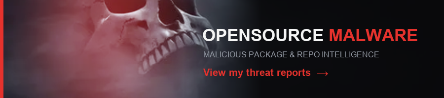

<p align="center">
  
</p>

<p align="center">
  
  <a href="LICENSE"></a>
  <a href="https://www.python.org"></a>
</p>

<p align="center">
  
</p>

> **The Warden cannot see. It listens for what code *does*.**
> Git Warden never executes a target; it reads the code statically and senses the
> behaviors that betray malice, the way the Warden senses vibration in the dark.

A defensive threat-intelligence engine that discovers, analyzes, and catalogs
**malicious GitHub repositories**. Threat-intel feeds
([MITRE ATT&CK](https://attack.mitre.org), [Google News](https://news.google.com),
[CISA](https://www.cisa.gov), [OpenSourceMalware](https://opensourcemalware.com))
are *provenance breadcrumbs*; they help find and attribute the repos. The product
is the registry of malicious repos.

See [docs/](docs/) for the design and [docs/IMPLEMENTATION.md](docs/IMPLEMENTATION.md)
for what's built vs. planned. Guiding principle: **accuracy over volume.**

<p align="center"></p>

## How it works

```
INGEST (breadcrumbs)                 HUNT (find malicious GitHub repos)
  MITRE ATT&CK ─┐                      ┌─ IOC search: mirror OSM IOCs into
  Google News  ─┼─ corroborate ─►      │   GitHub code search ----|
  CISA         ─┘   threat actors      ├─ red-team lineage: forks/│
  OpenSourceMalware ─► malicious       │   renames of pinned tools┤
     packages/repos + IOCs ────────────┘                          ▼
                                        Tier-1 screen (name+README, no clone)
                                                          │
                                        Tier-2 (clone + bash scanner + OSS
                                          scanners + code-hash dedup)
                                                          ▼
                                        Wall of Shame ─► Discord gold
```

<p align="center"></p>

## Wall of Shame

<p align="center">
  
</p>

Repositories Git Warden confirmed malicious by static analysis, refreshed on
every run. A repo confirms only on intrinsically malicious evidence
(`eval(atob(...))` injected into a build config, a reverse shell, a credential
steal-and-send); threat-intel leads (a malicious owner, a shared signature) only
*seed* which repos get scanned, never confirm one alone.

<!-- git-warden:registry:start -->
_Top 10 of 31 repositories confirmed malicious by static analysis this run, ranked by severity. The full list ships as the run's CSV artifact and to the Discord feed; every row's evidence (file, line, rule) is in that CSV. Dispute: open an issue and we will re-review._

| Repository | Detection | Score | Attribution | Proof (file:line rule) |
|------------|-----------|-------|-------------|------------------------|
| [`gauravraisharma/ticketting-system`](https://github.com/gauravraisharma/ticketting-system) | signature_match | 15 | unattributed | .vscode/tasks.json:0 install_hook/vscode-autorun  (+19 more) |
| [`alexsander532/projeto_dashboard_versao1`](https://github.com/alexsander532/projeto_dashboard_versao1) | signature_match | 14 | DPRK (North Korea) (per OSM) | frontend/vite.config.js:36 obfuscation/eval-decoded  (+3 more) |
| [`solarpy/caroline119-defi-property-4e3a113352e3`](https://github.com/solarpy/caroline119-defi-property-4e3a113352e3) | osm_repository | 13 | DPRK (North Korea) (per OSM) | caroline119-defi-property-4e3a113352e3/.vscode/tasks.json:0 install_hook/vscode-autorun  (+12 more) |
| [`lfirsl/morphix`](https://github.com/lfirsl/morphix) | osm_repository | 12 | DPRK (North Korea) (per OSM) | .vscode/tasks.json:0 install_hook/vscode-autorun  (+13 more) |
| [`usmanaliashraf/portfolio`](https://github.com/usmanaliashraf/portfolio) | signature_match | 12 | DPRK (North Korea) (per OSM) | postcss.config.mjs:12 obfuscation/eval-decoded  (+8 more) |
| [`icecoldjay/bri`](https://github.com/icecoldjay/bri) | signature_match | 11 | unattributed | client/tailwind.config.js:61 obfuscation/eval-decoded  (+3 more) |
| [`mts-services/olabisiolai_frontend_react`](https://github.com/mts-services/olabisiolai_frontend_react) | signature_match | 11 | unattributed | vite.config.ts:107 obfuscation/eval-decoded  (+4 more) |
| [`rajaxcodes/token-presale-dapp`](https://github.com/rajaxcodes/token-presale-dapp) | signature_match | 11 | unattributed | tasks.json:0 install_hook/vscode-autorun  (+5 more) |
| [`simalchaudhari/real-estate`](https://github.com/simalchaudhari/real-estate) | signature_match | 10 | unattributed | .vscode/tasks.json:0 install_hook/vscode-autorun  (+19 more) |
| [`abdurrahman224/kodesolution`](https://github.com/abdurrahman224/kodesolution) | signature_match | 9 | unattributed | vite.config.ts:25 obfuscation/eval-decoded  (+2 more) |
<!-- git-warden:registry:end -->

> [!NOTE]
> Every row's evidence (file, line, and the rule that fired) is in the per-run
> artifacts, so each listing is falsifiable. **Dispute a listing:** open an issue
> with the repository name and we will re-review and remove false positives.

<p align="center"></p>

## Bad Owners

Repositories whose **owner** ships malware we confirmed elsewhere, but which carry
no malicious evidence in their *own* code. Owner reputation is a provenance
breadcrumb, not proof, so these never reach the Wall of Shame above or the report
queue. They are listed here as elevated risk, with the owner's evidence-confirmed
repos as the provenance.

<!-- git-warden:badowners:start -->
_These repositories are NOT confirmed malicious on their own code. They appear only because their OWNER also publishes repositories we confirmed by static evidence (linked below, and on the Wall of Shame). Owner reputation is a provenance breadcrumb, not proof, so these never enter the registry or the report queue; treat them as elevated risk pending their own review._

| Repository | Owner | Owner provenance (repos confirmed on evidence) | Score |
|------------|-------|------------------------------------------------|-------|
| [`mts-services/kenndavi2_bbq_sauce_15_02_26_laravel`](https://github.com/mts-services/kenndavi2_bbq_sauce_15_02_26_laravel) | mts-services | [`mts-services/olabisiolai_frontend_react`](https://github.com/mts-services/olabisiolai_frontend_react) | 17 |
| [`mts-services/kenndavi2_clothing_15_02_26_laravel`](https://github.com/mts-services/kenndavi2_clothing_15_02_26_laravel) | mts-services | [`mts-services/olabisiolai_frontend_react`](https://github.com/mts-services/olabisiolai_frontend_react) | 17 |
| [`mts-services/kenndavi2_react`](https://github.com/mts-services/kenndavi2_react) | mts-services | [`mts-services/olabisiolai_frontend_react`](https://github.com/mts-services/olabisiolai_frontend_react) | 17 |
| [`mts-services/macktech_laravel`](https://github.com/mts-services/macktech_laravel) | mts-services | [`mts-services/olabisiolai_frontend_react`](https://github.com/mts-services/olabisiolai_frontend_react) | 17 |
| [`mts-services/may_writes`](https://github.com/mts-services/may_writes) | mts-services | [`mts-services/olabisiolai_frontend_react`](https://github.com/mts-services/olabisiolai_frontend_react) | 17 |
| [`mts-services/michaelalleva_04_march_26`](https://github.com/mts-services/michaelalleva_04_march_26) | mts-services | [`mts-services/olabisiolai_frontend_react`](https://github.com/mts-services/olabisiolai_frontend_react) | 17 |
| [`mts-services/mikylepersad_tow_truck_laravel`](https://github.com/mts-services/mikylepersad_tow_truck_laravel) | mts-services | [`mts-services/olabisiolai_frontend_react`](https://github.com/mts-services/olabisiolai_frontend_react) | 17 |
| [`mts-services/ok2wg5c6d_tareenhossain`](https://github.com/mts-services/ok2wg5c6d_tareenhossain) | mts-services | [`mts-services/olabisiolai_frontend_react`](https://github.com/mts-services/olabisiolai_frontend_react) | 17 |
| [`mts-services/timescape_laravel_26`](https://github.com/mts-services/timescape_laravel_26) | mts-services | [`mts-services/olabisiolai_frontend_react`](https://github.com/mts-services/olabisiolai_frontend_react) | 17 |
| [`mts-services/tungsol_dictionary_1_26`](https://github.com/mts-services/tungsol_dictionary_1_26) | mts-services | [`mts-services/olabisiolai_frontend_react`](https://github.com/mts-services/olabisiolai_frontend_react) | 17 |
<!-- git-warden:badowners:end -->

<p align="center"></p>

## Attribution

Confirmed repos are attributed to a **country of origin** by a multi-signal engine,
not a single tag. Git Warden names a country only on **2+ independent evidence
signals** (Contagious-Interview tradecraft, C2-infrastructure overlap with prior
campaign repos, a decoded BeaverTail/InvisibleFerret family fingerprint, or a
known-malicious dependency) **or** a specific named-group intel attribution (APT28,
Lazarus, Kimsuky, ...). A lone tradecraft vector or a bare nation tag stays a *lead*,
never an assertion, so a copycat is never over-attributed.

Each finding carries a confidence tier (confirmed / probable / possible /
unattributed) with the exact evidence listed, so every attribution is falsifiable.
The 18 seeded actors map to five origins (North Korea, Russia, China, Iran,
Cybercrime); adding a country is a data entry, and North Korea (Contagious Interview)
carries full evidence detectors today.

<p align="center"></p>

## Quick start

```bash
make install                     # pip install -e ".[dev]"  (or skip it: python gw.py <cmd>)
cp .env.example .env             # add GW_GITHUB_TOKEN, GW_OSM_API_KEY, ...
```

Credentials load from `.env` automatically (real env vars win). Tokens:

| Var | What | Notes |
|-----|------|-------|
| `GW_GITHUB_TOKEN` | GitHub PAT, **read-only public** | required for code search + 5k/hr |
| `GW_OSM_API_KEY` | OpenSourceMalware token (`osm_…`) | Bearer auth |
| `GW_DISCORD_WEBHOOK` | gold/alert channel | confirmed findings only |

(No NVD key needed; free OSINT feeds + OSM cover the intel sources for now.)

## Commands

A `Makefile` wraps the common flow (`make help` lists every target). It runs the
same on Linux and Windows, shelling out only to Python so there is no
bash-vs-cmd dependency (on Windows: Git Bash, scoop, or `choco install make`):

```bash
make ingest                      # feeds -> actors + OSM artifacts
make iocs                        # IOC pivot set mined from OSM
make discover                    # IOC code search -> new repos
make hunt                        # full pipeline -> Wall of Shame -> Discord (LIMIT=N caps it)
make review                      # list confirmed repos (ARGS="--approve owner/repo")
make serve                       # live telemetry dashboard
make check                       # lint + tests, run before pushing
```

Each target is a thin wrapper over the CLI, so without make you run it directly
(`python gw.py <cmd>`, or the installed `git-warden <cmd>`):

```bash
python gw.py ingest                         # feeds -> actors + OSM artifacts
python gw.py iocs                            # IOC pivot set mined from OSM
python gw.py discover                        # IOC code search -> new repos
python gw.py lineage --tool Sliver --screen 12   # red-team clones + Tier-1
python gw.py screen-artifacts                # Tier-1 over OSM repo scan-list
python gw.py hunt --scan --gold              # full pipeline -> Wall of Shame -> Discord
python gw.py review --approve owner/repo     # analyst-validate a confirmed repo
python gw.py probe --feed github --term lazarus  # probe any feed live
```

**Watching a run.** In a terminal, `hunt` shows a live, plain-language progress
view: per-source discovery counters, Tier-1/Tier-2 progress, and a run-number plus
a learning-corpus delta so you can see the yield compound across runs. It collapses
each run to four buckets: *repos scanned, signatures matched, code analysis passed,
queued for review.* Force it with `--progress on`, silence it with `--progress off`
(it auto-detects a terminal, so CI stays quiet). **Git Warden is iterative**: run 1
sets a baseline, and most batches reach high yield by run 3 as the corpus compounds.

## Dashboard

A live, read-only **telemetry dashboard** for exploring the registry visually,
built for data-driven review without touching the CLI:

```bash
make serve                       # or: python gw.py serve
#  ->  http://127.0.0.1:8787
```

It renders the **discovered product** as a force-graph (OSM re-validations are
hidden, so you see only what Git Warden surfaced):

- **Every repo is colored by attribution confidence**: confirmed (red), probable
  (orange), possible (yellow), unattributed (purple), clustered under its
  **origin-country hub** (North Korea, Russia, China, Iran, Cybercrime).
- **Click any repo** for the full picture: the confirming `file:line` evidence, the
  country attribution with its independent signals, the decoded payload, the C2
  infrastructure, and a **container-threat** badge when the Docker build recipe is
  malicious.
- Side panels break down attack vectors, C2 infrastructure, source yield and
  precision, the run timeline, and rejected false positives.

Local use needs no auth. For a deployment, set `GW_DASHBOARD_TOKEN` to require a
bearer token on `/api/*` (every request is logged).

## Submit to OSM

Contribute your confirmed findings back to
[OpenSourceMalware](https://opensourcemalware.com). The submitter is **safe by
design**: it is dry-run by default, uses *your* OSM API key (`GW_OSM_API_KEY`) and
contributor name (`GW_OSM_CONTRIBUTOR`), and **checks OSM before every send so it
never duplicates an existing report**.

```bash
make submit                          # dry run: prints exactly what WOULD be sent
make submit ARGS="--wizard"          # interactive, step-by-step (newcomer-friendly)
make submit ARGS="--reconcile"       # read-only: your reports vs OSM's live state
make submit ARGS="--confirm"         # actually POST new reports + corroborated C2 IOCs
```

Or directly: `python -m git_warden.osm_submit [--wizard|--reconcile|--confirm]`.

Only **novel** confirmed findings with their own `file:line` evidence are eligible;
OSM re-validations and un-evidenced associations are never sent. Each report carries
full proof: the country attribution with signals, every confirming evidence link, and
a plain-language writeup. `--wizard` walks a non-technical user through it step by
step, including exactly what to paste into OSM's web form.

## Deployment

GitHub Actions ([.github/workflows/](.github/workflows/)): `ci.yml` runs
lint+tests; `run.yml` runs ingest then hunt on demand (workflow_dispatch only,
no schedule), with an optional registry reconcile before publishing. Every
workflow hardens the runner first (Legion egress audit).

Add these **repo Actions secrets**; the workflow maps them onto the `GW_*` env
vars the code reads (local `.env` uses the `GW_*` names directly):

| Repo secret | Maps to env var.  |
|-------------|-----------------  |
| `GH_TOKEN`  | `GW_GITHUB_TOKEN` |
| `OSM_KEY`   | `GW_OSM_API_KEY`  |
| `GW_OSM_BASE_URL` | `GW_OSM_BASE_URL` (optional; overrides the default OSM host) |
| `DISCORD_WEBHOOK` | `GW_DISCORD_WEBHOOK` |

Orchestration knobs live in [config/settings.yaml](config/settings.yaml) and
[config/trigger.yaml](config/trigger.yaml).

## Development

```bash
make check                       # ruff + pytest (run before pushing)
make fmt                         # auto-fix lint findings
```

Or invoke the tools directly: `ruff check src tests gw.py` and `pytest -q`.

<p align="center"></p>

<p align="center">
  <a href="https://opensourcemalware.com/my-submissions">
    
  </a>
</p>
